# HRM2-Vue-FastAPI-Frontend

智能招聘管理系统（HRM2）的 Vue 3 前端应用，提供完整的 AI 辅助招聘流程管理界面。

## 🎯 系统概述

HRM2 是一个智能招聘管理系统，集成了 AI 技术来辅助 HR 完成从简历筛选到最终录用推荐的全流程管理。

### 核心特性

- 🤖 **AI 智能筛选** - 自动分析简历匹配度，生成多维度评估报告
- 🎥 **视频面试分析** - AI 分析候选人视频，评估综合素质
- 💬 **面试辅助系统** - 智能追问推荐、实时语音转录、AI 模拟面试
- 📊 **综合决策平台** - 整合所有数据，AI 生成最终录用建议

## 🛠️ 技术栈

| 类别 | 技术 | 版本 |
| ---- | ---- | ---- |
| 框架 | Vue.js | 3.5+ |
| 语言 | TypeScript | 5.9+ |
| 构建工具 | Vite | 7.1+ |
| UI 组件库 | Element Plus | 2.11+ |
| 状态管理 | Pinia | 3.0+ |
| 路由 | Vue Router | 4.6+ |
| HTTP 客户端 | Axios | 1.13+ |
| 图表库 | ECharts | 6.0+ |
| 代码高亮 | Highlight.js | 11.11+ |
| Markdown | Marked | 17.0+ |
| 文件解析 | Mammoth (Word) / PDF.js | - |

## 📁 项目结构

```
HRM2-Vue-FastAPI-Frontend/
├── src/
│   ├── api/                    # API 层（自动生成 + 封装）
│   │   ├── client/                # HTTP 客户端配置
│   │   ├── core/                  # 核心请求模块
│   │   ├── client.gen.ts          # 生成的客户端配置
│   │   ├── sdk.gen.ts             # 自动生成的 API SDK
│   │   ├── types.gen.ts           # 自动生成的类型定义
│   │   └── index.ts               # API 导出入口
│   ├── components/             # 组件
│   │   ├── common/                # 通用组件
│   │   ├── layout/                # 布局组件
│   │   ├── positions/             # 岗位管理组件
│   │   ├── screening/             # 简历筛选组件
│   │   ├── video/                 # 视频分析组件
│   │   ├── interview/             # 面试辅助组件
│   │   ├── recommend/             # 综合推荐组件
│   │   ├── library/               # 简历库组件
│   │   └── dev-tools/             # 开发工具组件
│   ├── composables/            # 组合式函数（13 个）
│   │   ├── useFileParser.ts           # 文件解析
│   │   ├── useHistoryTasks.ts         # 历史任务
│   │   ├── useInterviewAssist.ts      # 面试辅助逻辑
│   │   ├── usePositionEditor.ts       # 岗位编辑器
│   │   ├── usePositionManagement.ts   # 岗位管理
│   │   ├── useResumeAssignment.ts     # 简历分配
│   │   ├── useResumeDetail.ts         # 简历详情
│   │   ├── useResumeLibrary.ts        # 简历库
│   │   ├── useResumeUpload.ts         # 简历上传
│   │   ├── useScreeningUtils.ts       # 筛选工具
│   │   ├── useSidebar.ts              # 侧边栏状态
│   │   ├── useSpeechRecognition.ts    # 语音识别
│   │   └── useTaskPolling.ts          # 任务轮询
│   ├── views/                  # 页面视图（9 个）
│   │   ├── DashboardView.vue      # 仪表盘
│   │   ├── PositionsView.vue      # 岗位设置
│   │   ├── ResumeLibraryView.vue  # 简历库
│   │   ├── ScreeningView.vue      # 简历筛选
│   │   ├── VideoView.vue          # 视频分析
│   │   ├── InterviewView.vue      # 面试辅助
│   │   ├── RecommendView.vue      # 综合推荐
│   │   ├── SettingsView.vue       # 系统设置
│   │   └── DevToolsView.vue       # 开发测试
│   ├── router/                 # 路由配置
│   ├── types/                  # TypeScript 类型定义
│   │   ├── index.ts               # 类型导出
│   │   ├── position.ts            # 岗位类型
│   │   ├── resume.ts              # 简历类型
│   │   ├── task.ts                # 任务类型
│   │   └── video.ts               # 视频类型
│   ├── App.vue                 # 根组件
│   └── main.ts                 # 应用入口
├── tests/                      # 测试用例
│   ├── ai/                        # AI 功能测试
│   └── e2e/                       # 端到端测试
├── screenshots/                # 功能截图
├── public/                     # 静态资源
├── Docs/                       # 文档
├── scripts/                    # 构建脚本
├── openapi-ts.config.ts        # API 生成配置
├── package.json                # 项目配置
├── vite.config.ts              # Vite 配置
├── vitest.config.ts            # 单元测试配置
├── vitest.e2e.config.ts        # E2E 测试配置
├── vitest.ai.config.ts         # AI 测试配置
└── tsconfig.json               # TypeScript 配置
```

## 🚀 快速开始

### 环境要求

- Node.js >= 20.19.0 或 >= 22.12.0
- npm 或 pnpm

### 1. 安装依赖

```bash
npm install
```

### 2. 配置开发环境

确保后端服务运行在 `http://127.0.0.1:8000`，前端已配置 Vite 代理。

### 3. 启动开发服务器

```bash
npm run dev
```

前端默认运行在 `http://localhost:5174`

### 4. 构建生产版本

```bash
npm run build
```

### 5. 生成 API 客户端（可选）

当后端 API 变更时，可重新生成类型安全的 API 客户端：

```bash
npm run api:gen
```

## 📸 功能截图

### 仪表盘

系统首页，展示招聘数据统计、快捷操作入口、最近任务等信息。

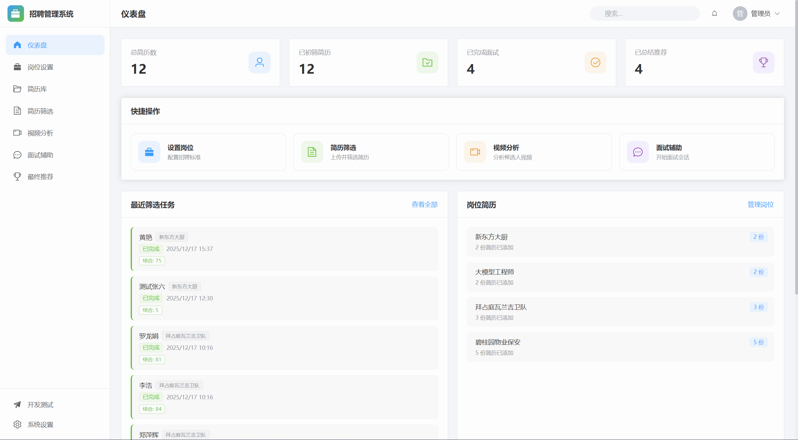

---

### 岗位设置

配置招聘岗位的基本信息、职责描述和筛选标准。

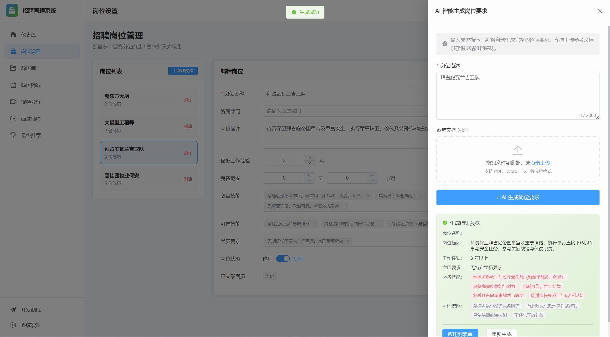

---

### 简历库

集中管理所有上传的候选人简历，支持搜索、筛选、批量操作。

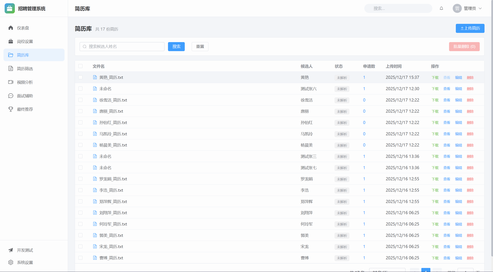

---

### 简历筛选

上传候选人简历，AI 自动进行初步筛选和匹配度分析。

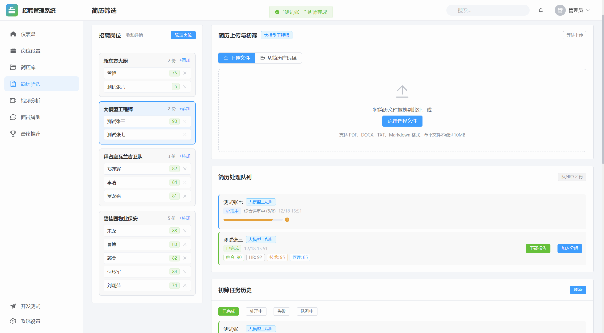

---

### 视频面试分析

上传候选人自我介绍视频，AI 分析表达能力、情绪状态等维度。

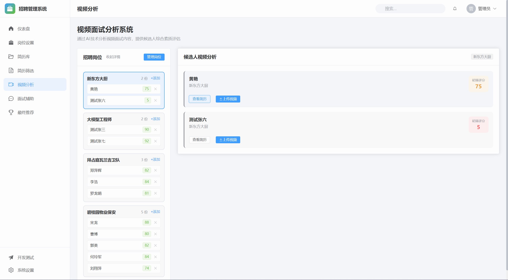

---

### 面试辅助系统

支持两种模式的智能面试辅助：

#### AI 模拟演示模式
使用虚拟候选人体验系统功能，了解面试流程。

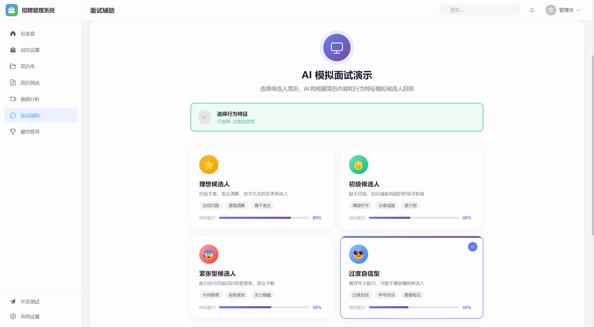

#### 真人实时面试模式
语音实时转文字，智能追问推荐，记录面试过程。

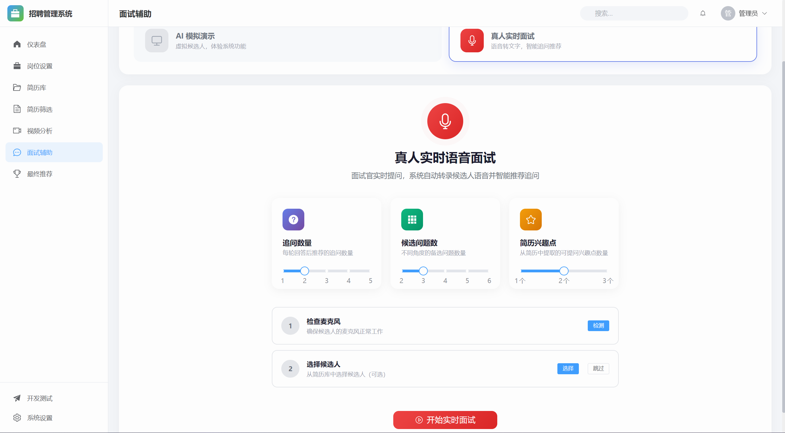

#### 面试进行中
面试过程中的实时界面，展示对话记录、智能追问推荐等功能。

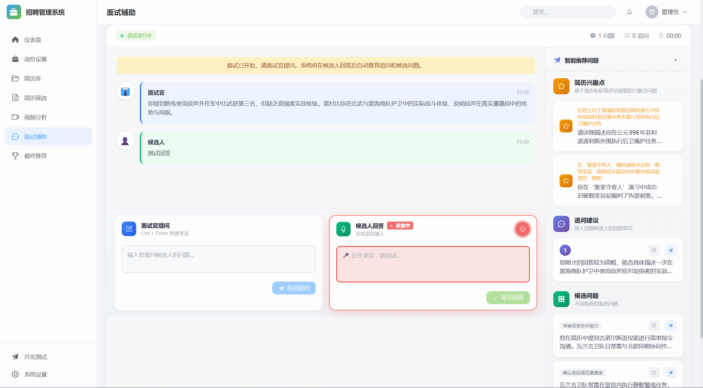

#### 实验性沉浸式面试
实时视频演示界面，提供更身临其境的面试体验。（仍在开发中）

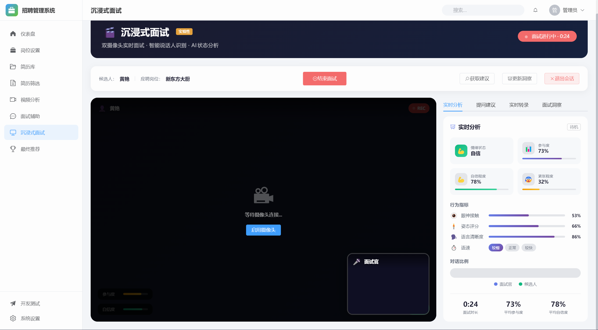

---

### 综合分析决策平台

整合简历、初筛报告、面试记录，AI 生成最终录用建议。

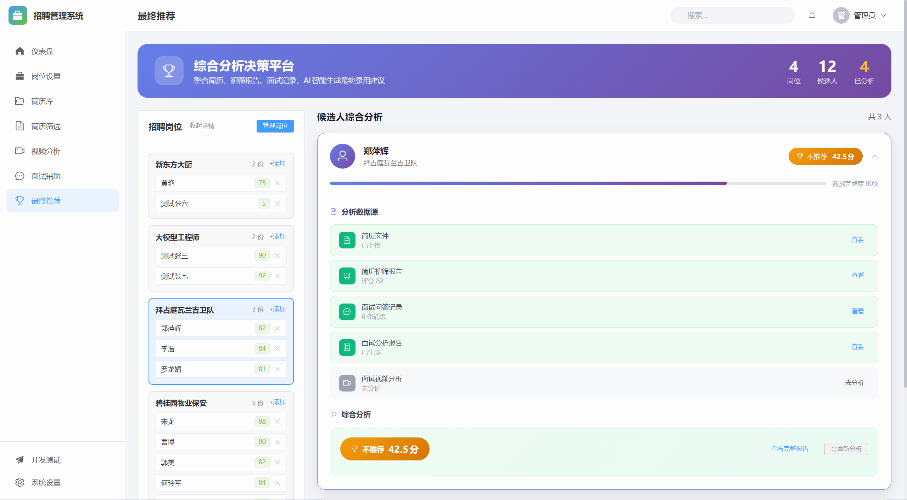

---

### 系统设置与开发测试

配置 API 连接、系统偏好、数据管理等。


开发测试工具、AI生成测试。

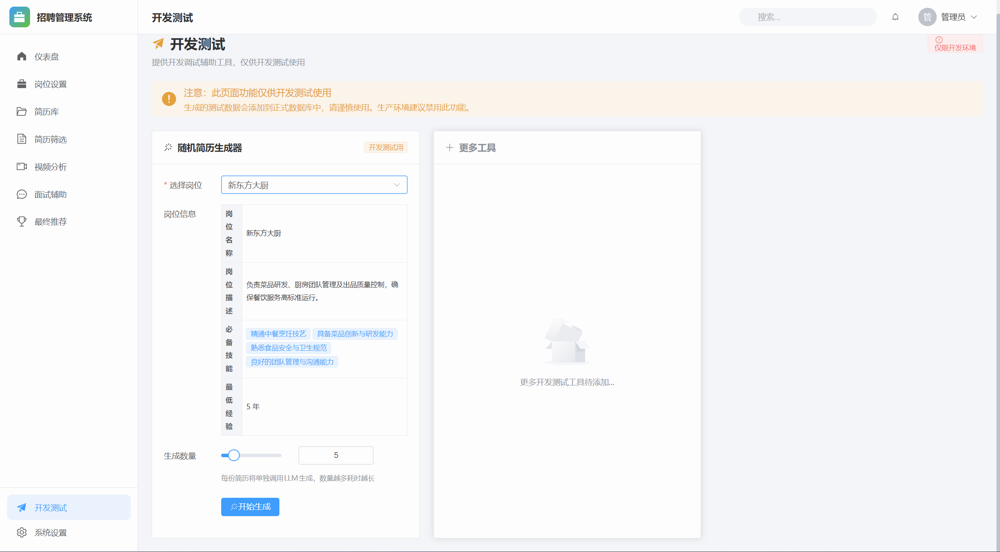

---

## 📋 功能模块详解

### 1. 仪表盘 (Dashboard)

| 功能 | 说明 |
| ---- | ---- |
| 数据统计 | 展示总简历数、已初筛、已面试、已推荐数量 |
| 快捷操作 | 一键进入各功能模块 |
| 最近筛选任务 | 显示最近完成的筛选任务及评分 |
| 岗位简历统计 | 各岗位收到的简历数量 |
| 最近视频分析 | 展示最近的视频分析任务状态 |

### 2. 岗位设置 (Positions)

| 功能 | 说明 |
| ---- | ---- |
| 岗位列表 | 查看所有招聘岗位 |
| 新建岗位 | 创建新的招聘岗位 |
| 编辑岗位 | 修改岗位名称、描述、筛选标准 |
| 删除岗位 | 移除不需要的岗位 |

### 3. 简历库 (Library)

| 功能 | 说明 |
| ---- | ---- |
| 简历列表 | 分页展示所有简历 |
| 搜索筛选 | 按候选人姓名搜索 |
| 上传简历 | 支持 PDF、Word、TXT 格式 |
| 批量删除 | 批量移除简历 |
| 查看/编辑 | 查看简历详情，编辑候选人信息 |
| 下载简历 | 导出简历文本内容 |

### 4. 简历筛选 (Screening)

| 功能 | 说明 |
| ---- | ---- |
| 岗位选择 | 选择目标招聘岗位 |
| 简历上传 | 上传候选人简历文件 |
| 从简历库选择 | 选择已有简历进行筛选 |
| 处理队列 | 实时显示筛选任务进度 |
| 历史任务 | 查看历史筛选记录和结果 |
| 筛选报告 | 查看 AI 生成的多维度评估报告 |
| 添加到岗位 | 将通过初筛的简历添加到岗位 |

### 5. 视频分析 (Video)

| 功能 | 说明 |
| ---- | ---- |
| 候选人列表 | 展示已通过初筛的候选人 |
| 视频上传 | 上传候选人自我介绍视频 |
| 分析状态 | 查看视频分析任务状态 |
| 分析报告 | 查看 AI 生成的视频分析结果 |

### 6. 面试辅助 (Interview)

| 功能 | 说明 |
| ---- | ---- |
| AI 模拟模式 | 与虚拟候选人进行模拟面试 |
| 真人面试模式 | 语音实时转文字，辅助真人面试 |
| 智能追问 | 基于候选人回答推荐追问问题 |
| 兴趣点提示 | 基于简历内容提示关注点 |
| 面试记录 | 自动记录面试问答内容 |
| 导出记录 | 导出面试记录为文本 |

### 7. 综合推荐 (Recommend)

| 功能 | 说明 |
| ---- | ---- |
| 候选人卡片 | 展示候选人的各项数据完成状态 |
| 简历查看 | 查看原始简历内容 |
| 初筛报告 | 查看简历筛选分析报告 |
| 面试记录 | 查看面试问答记录 |
| 面试分析 | 生成面试表现分析报告 |
| 综合分析 | AI 综合所有数据生成最终推荐 |
| 多维度评分 | 展示 Rubric 评估各维度得分 |

### 8. 系统设置 (Settings)

| 功能 | 说明 |
| ---- | ---- |
| API 配置 | 设置后端服务地址、超时时间 |
| 连接测试 | 测试后端服务连通性 |
| 系统偏好 | 自动刷新、通知、语言等设置 |
| 数据导出 | 导出系统配置数据 |
| 数据导入 | 从文件导入配置 |
| 清除缓存 | 清除本地存储数据 |

## 🔧 开发指南

### API 客户端生成

本项目使用 `@hey-api/openapi-ts` 从后端 OpenAPI 规范自动生成类型安全的 API 客户端：

```bash
# 确保后端服务运行中
npm run api:gen
```

生成的文件：
- `src/api/sdk.gen.ts` - API 调用函数
- `src/api/types.gen.ts` - TypeScript 类型定义

### 添加新页面

1. 在 `src/views/` 创建新的 Vue 组件
2. 在 `src/router/index.ts` 添加路由配置
3. 在 `src/components/layout/AppSidebar.vue` 添加导航项

### 组件开发规范

- 使用 Composition API (`<script setup>`)
- 复杂逻辑抽取到 `composables/` 
- 使用 Element Plus 组件库
- 样式使用 SCSS，配合 scoped

### 测试

```bash
# 运行单元测试
npm run test

# 运行端到端测试
npm run test:e2e

# 运行 AI 功能测试
npm run test:ai
```

## 📄 License

MIT License
